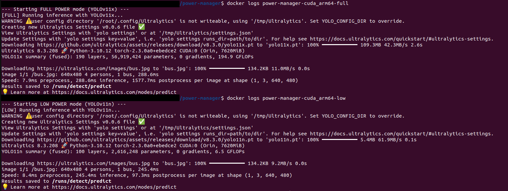

# power-manager-cuda

Jetson（JetPack 6 系 / L4T r36.x）で、**電源ソース（AC / バッテリー）に応じて Docker コンテナの電力プロファイル（フル / 低消費電力）を自動切替**するためのミニマルな構成です。  
`docker-compose.yml` で 2 つのサービス（フル/低電力）をビルドし、`power_manager.sh` が電源状態を判定してどちらかを起動します。


---

## 対象環境

- NVIDIA Jetson / JetPack 6.x（L4T r36.2.0 以降を想定）
- Docker / Docker Compose v2
- NVIDIA Container Runtime

---

## 事前準備（重要）

1. **NGC（NVIDIA GPU Cloud）のアカウント作成 & docker login**  
   ベースイメージは **`nvcr.io` の JetPack (L4T) イメージ**を利用します。初回は `docker login nvcr.io` が必要です。
   

      

   ```bash
   docker login nvcr.io
   # Username: $oauthtoken   # 文字列そのものを入力
   # Password: <NGCで発行したAPI Key>
   ```

3. **Docker の権限**  
   `docker` 実行に `sudo` が必要な環境では、以下のいずれかを選びます。
   - 毎回 `sudo` を付ける
   - またはユーザを `docker` グループへ追加（再ログイン/再起動が必要）
     ```bash
     sudo usermod -aG docker $USER
     sudo reboot
     ```

---

## クイックスタート


1) リポジトリをクローン
```bash
git clone https://github.com/koh11235813/power-manger-cuda.git && cd power-manger-cuda
```

2) ビルド（初回は nvcr.io へのログインが必要）
```bash
docker compose build
```

3) 実行（電源状態に応じてフル/低電力のどちらかが起動）
```bash
./power_manager.sh
```

- 偽の電源情報スクリプト`fake_power_source.sh` によって電源情報を生成しています。

---
## example logs


## スワップ（Swap）拡張のヒント

> **推奨:** 物理メモリが不足しやすい場合は、**SSD を増設**してスワップ領域を確保するのが安全です。

### A. SSD を増設してパーティションを Swap に割り当て（推奨）
1. 新規 SSD を接続しパーティション作成（例：`/dev/nvme1n1p2`）。
>   `sudo fdisk -l`でディスク名を確認してから`sudo cfdisk /dev/nvmeXn`でTUIでLinux SwapとLinux file Systemに割るのが早いです。  
3. 初期化と有効化：
   ```bash
   sudo mkswap /dev/nvme1n1p2
   sudo swapon /dev/nvme1n1p2
   ```
4. 永続化のため `/etc/fstab` に追記：
   ```fstab
   /dev/nvme1n1p2  none  swap  sw  0  0
   ```

### B. 既存ストレージ上のスワップファイルを拡張
```bash
# 例: /swapfile を 16GiB に作成/再作成
sudo swapoff /swapfile 2>/dev/null || true
sudo dd if=/dev/zero of=/swapfile bs=1G count=16 status=progress
sudo chmod 600 /swapfile
sudo mkswap /swapfile
sudo swapon /swapfile

# 永続化: /etc/fstab に以下の行を追加
# /swapfile  none  swap  sw  0  0
```

### C. SD カードに割り当てたい場合
- 書き込み寿命やパフォーマンスの観点で注意が必要です。**必ずボード/ディストリの公式手順**に従ってください（機種や OS により設定が異なります）。

---

- `docker-compose.yml` には **AC 用（フル）** と **バッテリー用（低電力）** の 2 サービスが定義されています。
- `power_manager.sh` は電源状態を判定し、該当するサービスのみを起動します。
- `fake_power_source.sh` は電源状態の模擬用です。

---

## トラブルシューティング

- **`docker pull nvcr.io/...` で認証エラーになる**  
  `docker login nvcr.io` を実施し、**Username は `$oauthtoken`、Password は NGC の API Key** を入力しているか確認してください。

- **一般ユーザで `docker` が動かない**  
  `sudo usermod -aG docker $USER` を実行し、再ログインまたは再起動してください。

---

## ライセンス

本リポジトリは [MIT License](LICENSE) です。
